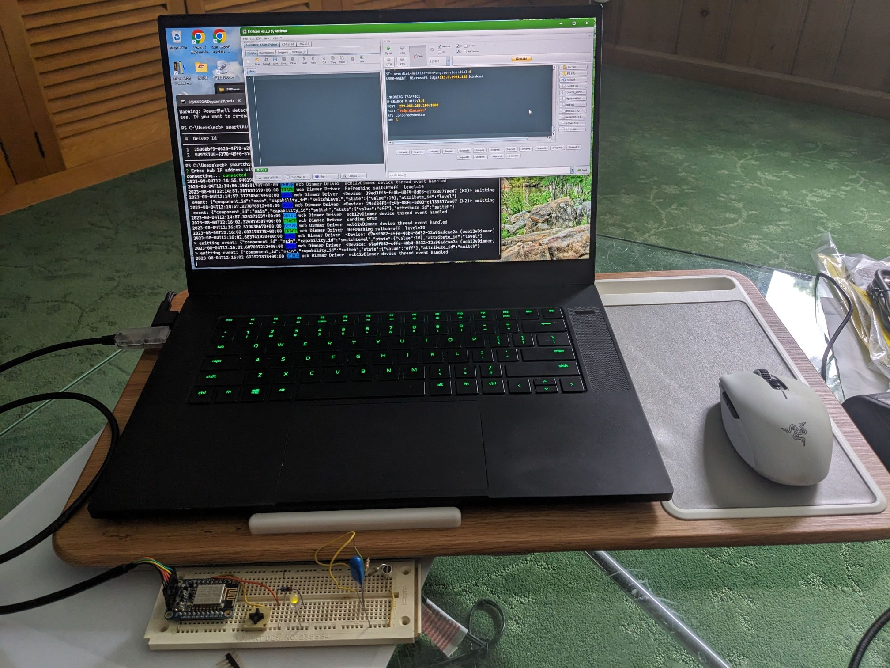

# wcb12vDimmer - Device & SmartThings driver
Created in response to Samsung's  ending support for Groovey drivers. While I think I can write an edge driver to work with my original Smart Led Dimmer firmware, I decided it would be quicker to modify the [Sample Edge Driver for ESP8266 Light bulb](https://github.com/SmartThingsDevelopers/SampleDrivers/tree/main/lightbulb-lan-esp8266) (and I was in a hurry to get my lights working again).



This version is less capable than the original in that it has no provision for fade/brighten rate adjustment or for OTA updates.  I tried to include the update capability as I did for my similar [Xmas Lites](https://kit-barnes.github.io/Kits_Project_Website/XmasLites/index.htm) device, but frustratingly, I have not been able to LFS working in the new NodeMCU build required.
## Device
The device hardware is identical to my [Smart LED Dimmer](https://kit-barnes.github.io/Kits_Project_Website/smartLEDdimmer/index.htm) so I will not describe it here.

Firmware and Initial configuration:
- Create a NodeMCU build from the master branch at https://nodemcu-build.com/ 
  including modules:  file, gpio, http, net, node, pwm2, sjson, tmr, uart, and wifi or use the build in app/NodeMCU.
- Load the float version into Adafruit HUZZAH ESP8266 module with [NodeMCU PyFlasher](https://github.com/marcelstoer/nodemcu-pyflasher) per this [Adafruit article](https://learn.adafruit.com/adafruit-huzzah-esp8266-breakout/using-nodemcu-lua).
- Upload app/src files: config.lua, device_control.lua, init.lua, responses.lua, server.lua and upnp.lua to device with ESPlorer.
- Reset or Reboot the device aand connect to its WiFi SSID: wcbDimmer Password: dummy123
- Browse to http://192.168.4.1 and enter the ssid and password of the hub's WiFi.

## Driver
Install the [SmartThings CLI](https://github.com/SmartThingsCommunity/smartthings-cli)

### Uploading Your Driver to SmartThings
- Compile the driver:

```
smartthings edge:drivers:package driver/
```

- Create a channel for the driver

```
smartthings edge:channels:create
```

- Enroll the driver into the channel

```
smartthings edge:channels:enroll
```

- Publish the driver to the channel

```
smartthings edge:drivers:publish
```

- Install the driver into the hub:

```
smartthings edge:drivers:install
```
- You should see the confirmation message: `Driver {driver-id} installed to Hub {hub-id}`

- Use your WiFi router or the [SmartThings IDE](https://account.smartthings.com/login) > My Hubs to locate and copy the IP Address for your Hub.

- From a computer on the same local network as your Hub, open a new terminal window and run this command to get the log from your driver.

```
smartthings edge:drivers:logcat --hub-address=x.x.x.x {driver-id}
```

## Onboarding (Connect device to SmartThings hub)
Reset (or powercycle) the device.

Then, in the _SmartThings App_:

   - Select **Add (+)** and then **Device**.
   - Tap on **Scan nearby**.
   - The app should find the device and add it automatically, offering to take you to its assigned room.

If the scan does not find the dimmer,
- Ensure the hub and dimmer are connected to the same WiFi SSID
- Powercycle the dimmer and try again -
checkimg the _logcat_ session.

